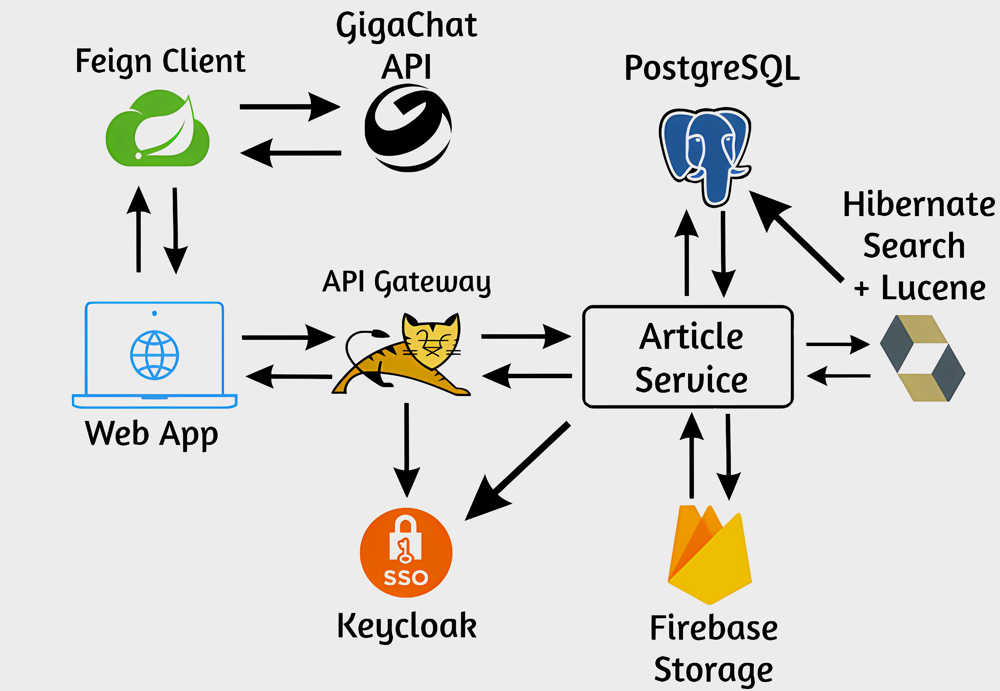

**Статья**

* Создание статьи
* Редактирование статьи
* Удаление статьи
* Просмотр статьи
* Поиск статьи

**Firebase Storage**

* Загрузка файлов
* Получение файлов по ссылке
* Удаление файлов

**Gigachat API**

* Отправка сообщений
* Получение сообщений

**Hibernate Search + Lucene**

* Индексация сущностей
* Поиск по индексированным сущностям

**SSO Keycloak**

* Аутентификация пользователей
* Авторизация пользователей

**Web App**

* Отображение статей
* Поиск статей
* Создание статей
* Редактирование статей
* Удаление статей

**API Gateway Apache Tomcat**

* Маршрутизация запросов
* Обеспечение безопасности (ssl)

**Article Service**

* Выполнение бизнес-логики
* Взаимодействие с базой данных
* Взаимодействие с другими сервисами

**PostgreSQL**

* Хранение данных

**Feign Client**

* Взаимодействие с REST API

**Бизнес-процессы**

* **Публикация статьи**

1. Пользователь создает статью в веб-приложении.
2. Веб-приложение отправляет запрос на создание статьи в API Gateway Apache Tomcat.
3. API Gateway Apache Tomcat маршрутизирует запрос в Article Service.
4. Article Service создает статью в базе данных PostgreSQL.
5. Article Service возвращает ответ веб-приложению.
6. Веб-приложение отображает статью пользователю.

* **Создание статьи с использованием Gigachat API и Feign Client**

1. Пользователь создает статью в веб-приложении, заполняя все поля, кроме текста статьи.
2. Веб-приложение использует Feign Client для отправки запроса на создание статьи в Gigachat API.
3. Feign Client генерирует HTTPS-запрос и отправляет его в Gigachat API.
4. Gigachat API генерирует текст статьи на основе полученной информации.
5. Gigachat API возвращает сгенерированный текст статьи в Feign Client.
6. Feign Client возвращает сгенерированный текст статьи в веб-приложение.
7. Веб-приложение создает статью в базе данных PostgreSQL, используя сгенерированный текст.
8. Веб-приложение возвращает ответ пользователю.
9. Веб-приложение отображает статью пользователю.

* **Редактирование статьи**

1. Пользователь редактирует статью в веб-приложении.
2. Веб-приложение отправляет запрос на редактирование статьи в API Gateway Apache Tomcat.
3. API Gateway Apache Tomcat маршрутизирует запрос в Article Service.
4. Article Service редактирует статью в базе данных PostgreSQL.
5. Article Service возвращает ответ веб-приложению.
6. Веб-приложение отображает статью пользователю.

* **Удаление статьи**

1. Пользователь удаляет статью в веб-приложении.
2. Веб-приложение отправляет запрос на удаление статьи в API Gateway Apache Tomcat.
3. API Gateway Apache Tomcat маршрутизирует запрос в Article Service.
4. Article Service удаляет статью из базы данных PostgreSQL.
5. Article Service возвращает ответ веб-приложению.
6. Веб-приложение отображает сообщение пользователю о том, что статья удалена.

* **Просмотр статьи**

1. Пользователь просматривает статью в веб-приложении.
2. Веб-приложение отправляет запрос на просмотр статьи в API Gateway Apache Tomcat.
3. API Gateway Apache Tomcat маршрутизирует запрос в Article Service.
4. Article Service получает статью из базы данных PostgreSQL.
5. Article Service возвращает статью веб-приложению.
6. Веб-приложение отображает статью пользователю.

* **Пересказ статьи с использованием Gigachat API и Feign Client**

1. Пользователь нажимает кнопку "Пересказать" на главной странице статей.
2. Веб-приложение использует Feign Client для отправки запроса на пересказ статьи в Gigachat API.
3. Feign Client генерирует HTTPS-запрос и отправляет его в Gigachat API.
4. Gigachat API извлекает поля статьи из базы данных PostgreSQL.
5. Gigachat API отправляет поля статьи в Gigachat API.
6. Gigachat API генерирует пересказ статьи на основе полученных полей.
7. Gigachat API возвращает пересказ статьи в Feign Client.
8. Feign Client возвращает пересказ статьи в веб-приложение.
9. Веб-приложение отображает пересказ статьи пользователю.

* **Поиск статьи**

1. Пользователь вводит поисковый запрос в веб-приложении.
2. Веб-приложение отправляет запрос на поиск статьи в API Gateway Apache Tomcat.
3. API Gateway Apache Tomcat маршрутизирует запрос в Article Service.
4. Article Service выполняет поиск статьи в базе данных PostgreSQL.
5. Article Service возвращает результаты поиска веб-приложению.
6. Веб-приложение отображает результаты поиска пользователю.
